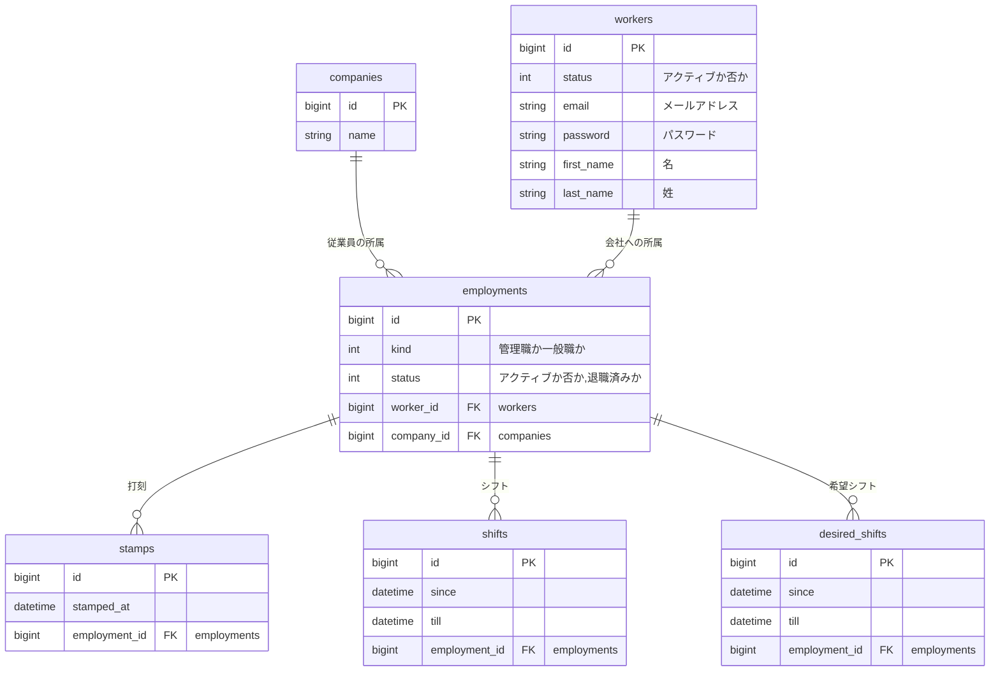

```mermaid
erDiagram
  companies ||--o{ employments : "従業員の所属"
  workers ||--o{ employments : "会社への所属"
  employments ||--o{ stamps : "打刻"
  employments ||--o{ shifts : "シフト"
  employments ||--o{ desired_shifts : "希望シフト"

  companies {
    bigint id PK
    string name
  }
  employments {
    bigint id PK
    int kind "管理職か一般職か"
    int status "アクティブか否か,退職済みか"
    bigint worker_id FK "workers"
    bigint company_id FK "companies"
  }
  workers {
    bigint id PK
    int status "アクティブか否か"
    string email "メールアドレス"
    string password "パスワード"
    string first_name "名"
    string last_name "姓"
  }

  stamps {
    bigint id PK
    datetime stamped_at
    bigint employment_id FK "employments"
  }
  shifts {
    bigint id PK
    datetime since
    datetime till
    bigint employment_id FK "employments"
  }
  desired_shifts {
    bigint id PK
    datetime since
    datetime till
    bigint employment_id FK "employments"
  }
```
