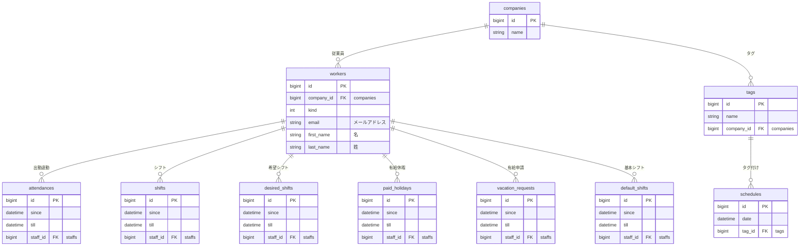

```mermaid
erDiagram
  companies ||--o{ workers : "従業員"
  companies ||--o{ tags : "タグ"
  tags ||--o{ schedules : "タグ付け"
  workers ||--o{ attendances : "出勤退勤"
  workers ||--o{ shifts : "シフト"
  workers ||--o{ desired_shifts : "希望シフト"
  workers ||--o{ paid_holidays : "有給休暇"
  workers ||--o{ vacation_requests : "有給申請"
  workers ||--o{ default_shifts : "基本シフト"

  companies {
    bigint id PK
    string name
  }
  workers {
    bigint id PK
    bigint company_id FK "companies"
    int kind
    string email "メールアドレス"
    string first_name "名"
    string last_name "姓"
  }

  attendances {
    bigint id PK
    datetime since
    datetime till
    bigint staff_id FK "staffs"
  }

  shifts {
    bigint id PK
    datetime since
    datetime till
    bigint staff_id FK "staffs"
  }
  desired_shifts {
    bigint id PK
    datetime since
    datetime till
    bigint staff_id FK "staffs"
  }
  default_shifts {
    bigint id PK
    datetime since
    datetime till
    bigint staff_id FK "staffs"
  }
  
  tags {
    bigint id PK
    string name
    bigint company_id FK "companies"
  }
  schedules {
    bigint id PK
    datetime date
    bigint tag_id FK "tags"
  }

  paid_holidays {
    bigint id PK
    datetime since
    datetime till
    bigint staff_id FK "staffs"
  }
  vacation_requests {
    bigint id PK
    datetime since
    datetime till
    bigint staff_id FK "staffs"
  }
```