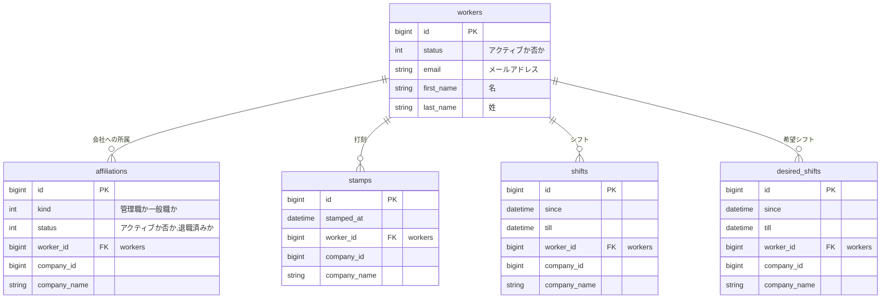

```mermaid
erDiagram
  workers ||--o{ affiliations : "会社への所属"
  workers ||--o{ stamps : "打刻"
  workers ||--o{ shifts : "シフト"
  workers ||--o{ desired_shifts : "希望シフト"

  affiliations {
    bigint id PK
    int kind "管理職か一般職か"
    int status "アクティブか否か,退職済みか"
    bigint worker_id FK "workers"
    bigint company_id
    string company_name
  }
  workers {
    bigint id PK
    int status "アクティブか否か"
    string email "メールアドレス"
    string first_name "名"
    string last_name "姓"
  }

  stamps {
    bigint id PK
    datetime stamped_at
    bigint worker_id FK "workers"
    bigint company_id
    string company_name
  }

  shifts {
    bigint id PK
    datetime since
    datetime till
    bigint worker_id FK "workers"
    bigint company_id
    string company_name
  }
  desired_shifts {
    bigint id PK
    datetime since
    datetime till
    bigint worker_id FK "workers"
    bigint company_id
    string company_name
  }
```
